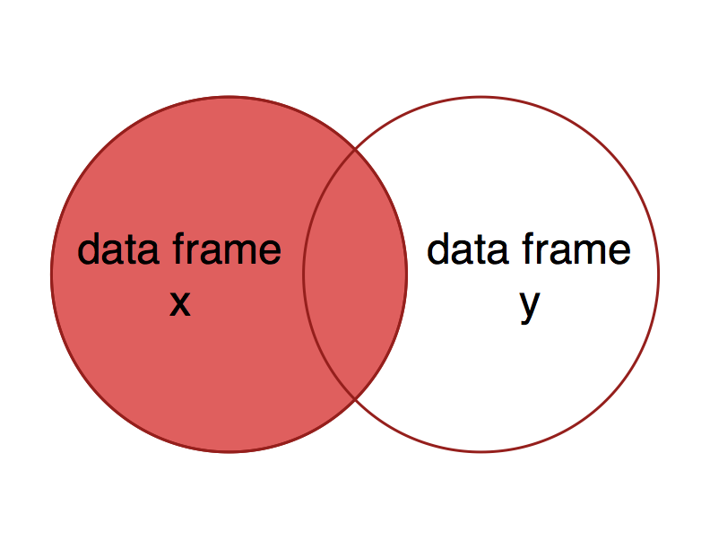
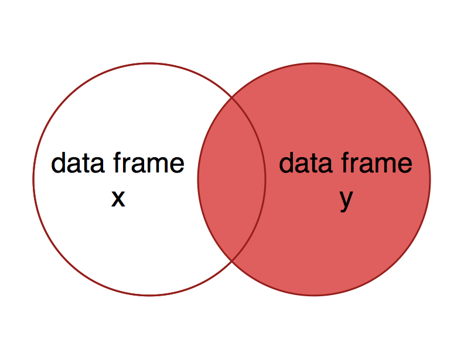
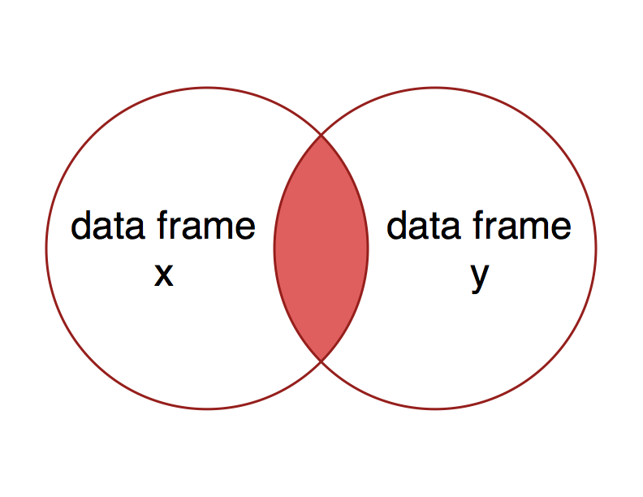
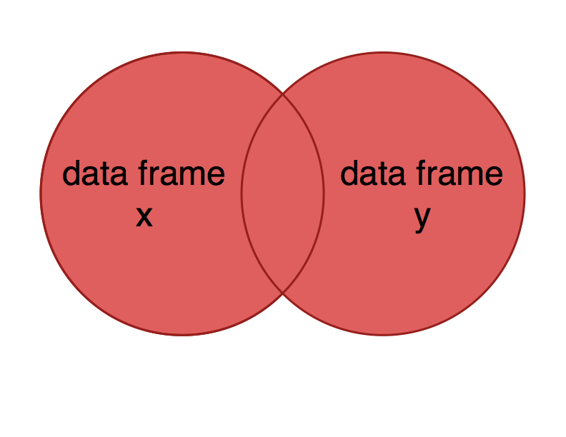
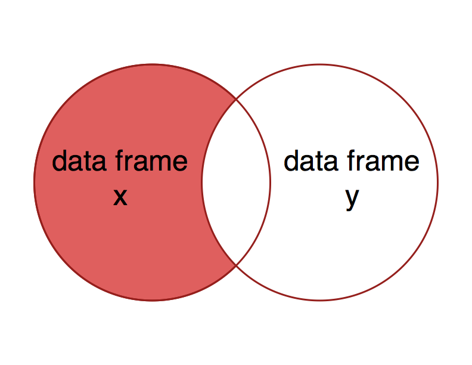

This activity was adapted from Lindsay Brin's [join tutorial](https://github.com/lindsaydbrin/CREATE_R_Workshop/blob/master/Lessons_Rmd/Lesson%20-%20dplyr%20join.Rmd) which was also adapted from Data Carpentry’s Data Analysis and Visualization in R curriculum.

```{r}
library(dplyr)
```

# Why, and what? {#motivation}

Sometimes you may want to conduct analyses with data that are in separate data frames, and you need to combine the data frames into one to do so. Using functions to accomplish this is much more efficient than trying to match entries manually!   

There are multiple ways to join two data frames, depending on the variables and information we want to include in the resulting data frame. The package `dplyr` has several functions for joining data, and these functions fall into two categories, mutating joins and filtering joins.   

* **Mutating joins** add new variables from one table to matching observations in another table.
* **Filtering joins** retain observations in one table based on whether or not they match the observations in another table.

For more information and examples, see the dplyr [Two-table verbs vignette](https://cran.r-project.org/web/packages/dplyr/vignettes/two-table.html).

# Mutating joins {#mutatingJoins}

There are four types of mutating joins, which we will explore below:

* Left joins (`left_join`) 
* Right joins (`right_join`)
* Inner joins (`inner_join`)
* Full joins (`full_join`)

Mutating joins add variables to data frame `x` from data frame `y` based on matching observations between tables. The different joins have different controls on, or rules for, which observations to include.

Let's start with the hypothetical data frame described in the reshaping lesson, containing nutrient concentrations for 3 replicates for each of 2 treatments. We also have measurements of extractable organic carbon from the same samples, except that replicate 2 of treatment 1 was lost, and the carbon data file contains data for another treatment, treatment 3.     

We'll read in the data from .csv files.  

```{r}
nutrients <- read.csv(file="Experiment_nutrients.csv")
nutrients
```

```{r}
carbon <- read.csv(file="Experiment_carbon.csv")
carbon
```


## Left join {#leftJoin}

Let's say that we want to add data on carbon concentration to the observations in the `nutrients` data frame. Specifically, we want to keep all of the observations in the `nutrients` data frame, and add another variable from the `carbon` data frame, `Carbon`, that contains carbon data when present and `NA` when values are missing. To do this, we can use the function `left_join`.  This the type of join that you will likely want to use most often.

The term *left join* can be explained using a Venn diagram. The circle on the left is data frame `x`, and the one on the right is data frame `y`. The overlap between the two circles represents the observations with keys that are present in both data frames. The result of a left join is all of data frame `x`, plus the parts of data frame `y` with overlapping keys - i.e., the left side of the Venn diagram.   

```{r, echo=FALSE, out.width = '400pt', fig.align='center'}

```

To do a left join on `nutrients`, adding variables from `carbon`, we would use the following syntax.

```{r}
nutrients %>% 
  left_join(y=carbon, by=c("Treatment","Replicate"))
```

The argument `y` specifies the data frame from which to find data to add to `nutrients`. You can specify `x` as the data frame to act on, which would be `nutrients`, but we have passed it via `%>%` instead. The last argument, `by`, specifies which columns to join by - i.e., the keys. The default is to do a natural join, which means that the function will use all columns that are present in both data frames.  

Let's explore the `by` argument a bit further. What happens if we do a left join using only one of the `by` variables specified above, e.g., `Treatment`? What has happened to give the results below?

```{r}
nutrients %>% 
  left_join(y=carbon, by=c("Treatment"))
```

Take a look at `Replicate.x` and `Replicate.y` to sort out what has happened here. The variable `Replicate` was present in both data frames, and the new data frame includes a variable for each, specified by ".x" or ".y" at the end of the variable name. Also, the number of observations has increased. Remember that we tried to join by `Treatment`. The problem here is that there are multiple observations (`Replicate`s) for each `Treatment` value in both `x` and `y`, so the resulting data frame includes all combinations of `Replicate.x` and `Replicate.y` within each `Treatment`.  

Note that this may not be what you wanted, but it does not result in an error or warning! This is a good demonstration of why it's important to understand the behaviour of functions that you use, and to check the results of intermediate steps in your analysis.  

#### Exercises

1. What happens if you use a left join to add `nutrients` data to the `carbon` data set, rather than vice versa?

2. The data frame `climates` has information on mean annual temperature and precipitation for the sites in the `trees` data frame. Read in `climates.csv` and `trees.csv`, and use a `left_join` to add these climate data to `trees`. Take a look at the data first to determine which variable(s) to join by.

```{r}
climates <- read.csv(file="climates.csv")
trees <- read.csv(file="trees.csv")

```

3. Read in two files, `genes.csv` and `metals.csv`, and call the resulting data frames `genes` and `metals`. `genes` has data on the abundance of different nitrogen cycling genes in soils at several agricultural sites, and `metals` has data on concentrations of different metals in soils at some of the same agricultural sites. Use a left join to add the metal concentration data to the observations in `genes`. Take a look at the data first to determine which variable(s) to join by.

```{r}
genes <- read.csv(file="genes.csv")
metals <- read.csv(file="metals.csv")

```


## Right join {#rightJoin}

A right join is conceptually similar to a left join, but includes all the observations of data frame `y` and matching observations in data frame `x` - the right side of the Venn diagram.  

```{r, echo=FALSE, out.width = '400pt', fig.align='center'}

```

What would you expect to get as a result of a right join using x = `nutrients` and y = `carbon`?

```{r}
nutrients %>% 
  right_join(y=carbon, by=c("Treatment", "Replicate"))
```

#### Exercises

4. How does the result from `right_join(x=nutrients, y=carbon)` compare to that of `left_join(x=carbon, y=nutrients)`?   

```{r}
right_join(x = nutrients, y = carbon)

left_join(x = nutrients, y = carbon)
```


## Inner join {#innerJoin}

What if you want to include only the observations in both data frames, and omit observations with missing data?  In this case, you can use an inner join.  

An inner join includes observations with keys that are present in both data frames. This is the same as keeping only the observations in `x` that have a matching observation in `y`.   

```{r, echo=FALSE, out.width = '400pt', fig.align='center'}

```

What would you expect to get as a result of an inner join using x = `nutrients` and y = `carbon`?

```{r}
nutrients %>% 
  inner_join(y=carbon, by=c("Treatment", "Replicate"))
```

You can see that `Replicate` 2 of `Treatment` 1 is not included because there was no observation associated with it in the `carbon` data.

#### Exercises

5. What would you expect to get as a result of the above join function if the `carbon` data set included an `NA` for the missing `Replicate` 2 for `Treatment` 1?

We would expect a similar outcome for the one above, except that treament 1, replicate 2 will not be included in the dataset anymore


## Full join {#fullJoin}

You might want a data frame that includes all data from both data sets, whether or not observations are missing in one or the other.  This is analogous to including both circles in a Venn diagram.

```{r, echo=FALSE, out.width = '400pt', fig.align='center'}

```

Which observations would you expect to be included in the result of a full join using x = `nutrients` and y = `carbon`?

```{r}
nutrients %>% 
  full_join(y=carbon, by=c("Treatment", "Replicate"))
```

#### Exercises

6. Create a data frame with data from all sites included in the data frames `genes` and `metals`, which we used for the left join challenges above.

```{r}
full_genes_metals = genes %>% full_join(metals, by = "Site")

full_genes_metals
```

# Filtering joins {#filteringJoins}

As demonstrated above, mutating joins compare observations from two data frames to determine which variables to add. In contrast, filtering joins keep only observations from the first data frame, and compare observations to a second data frame to determine which observations to keep. Filtering joins will only ever remove observations, and never add them.   

There are two types of filtering joins:  

* Semi joins (`semi_join`) - keep all observations in `x` that have a match in `y`
* Anti joins (`anti_join`) - keep all observations in `x` that do not have a match in `y`

## Semi join {#semiJoin}

Semi joins keep all observations in `x` that have a match in `y`. The Venn diagram depicting this join is the same as that for an `inner_join`. 

```{r, echo=FALSE, out.width = '400pt', fig.align='center'}

```

The observations in the resulting data frame are also often the same as a `inner_join`. For example, compare the following:

```{r}
nutrients %>% 
  inner_join(y=carbon, by=c("Treatment", "Replicate"))

nutrients %>% 
  semi_join(y=carbon, by=c("Treatment", "Replicate"))
```

Notice that the observations in both data frames are the same, but that the inner join adds the variable `Carbon` from the data frame `carbon`, whereas the semi join only uses the `carbon` data frame to determine which observations to keep.

#### Exercises
7. A semi join can be useful for determining the action of a `left_join` before calling it, i.e., to see what observations will have values that will be included, rather than `NA`. Compare the output from following commands. Why are the data frames different if the data frames are joined using`by=c("Treatment")`?

```{r}
genes %>%
  semi_join(metals, by = "Site")

genes %>%
  semi_join(metals)
```

both are identical for the semi join with genes and metals because semi_join returns all rows with a x with a match in y. 

## Anti joins  {#antiJoin}

Anti joins keep all observations in `x` that do not have a match in `y`. This might be useful if, for example, you have your main data in table `x`, and a second table that specifies data that you'd like to omit. Alternatively, this type of join might be part of a pipeline comparing an updated data frame to an older version to determine which observations are new.

```{r, echo=FALSE, out.width = '400pt', fig.align='center'}

```

An anti join can be used to determine which observations in `x` are missing data in `y`. Say we want to know which observations in `nutrients` are missing data in `carbon`. In this case, we could do the following:  

```{r, eval=TRUE}
  nutrients %>% 
  anti_join(y=carbon, by=c("Treatment", "Replicate"))
```

#### Exercises
8. What do you expect to see as a result of calling an anti join on `carbon`, specifying `nutrients` as data frame `y`? Describe this in words.

I would expect the three treaments not in nutrients to be in the new data frame made by the anti_join()

```{r}
carbon %>%
  anti_join(nutrients)
```


